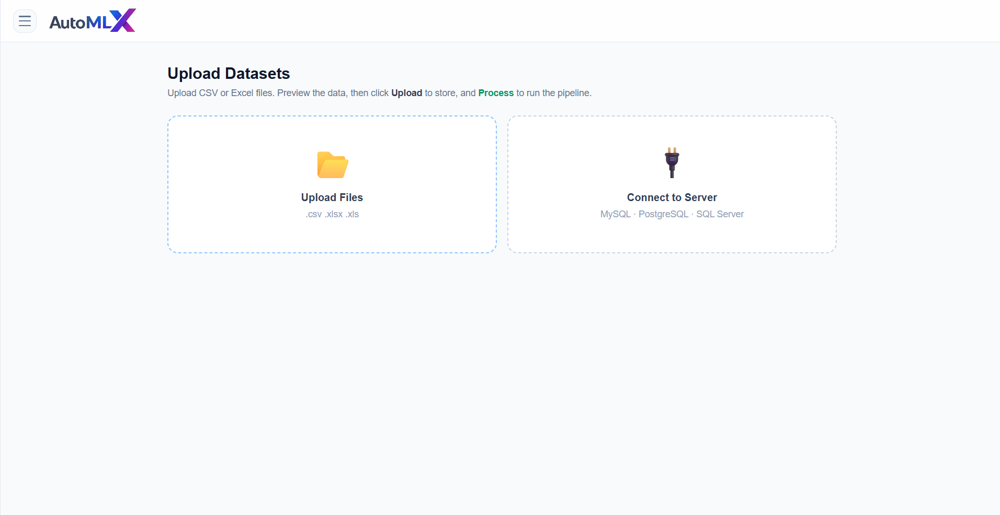
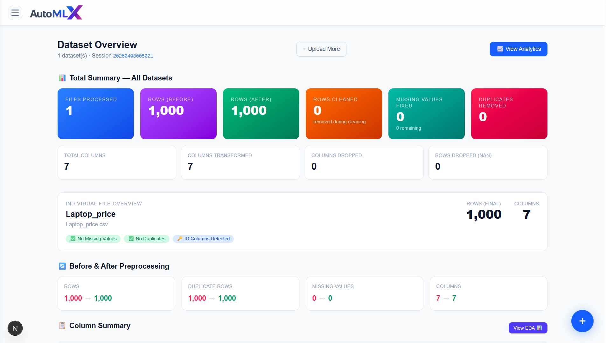
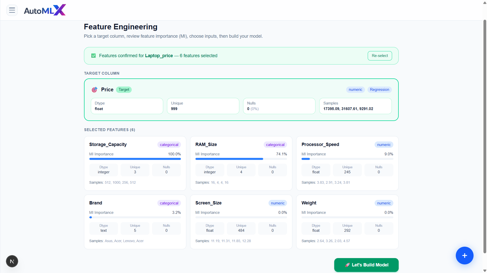
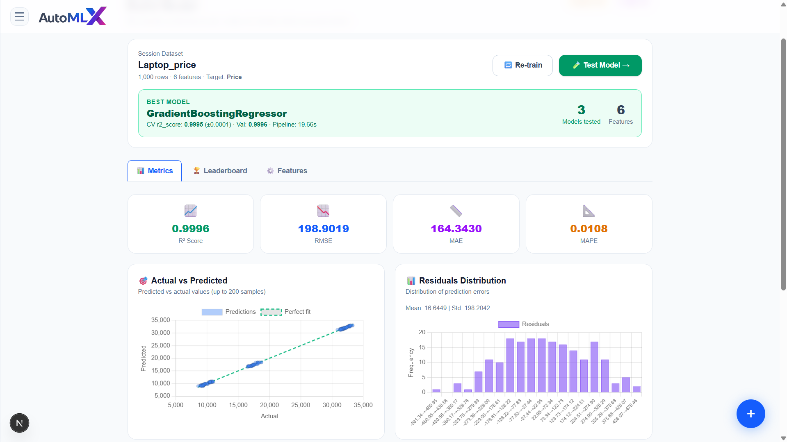
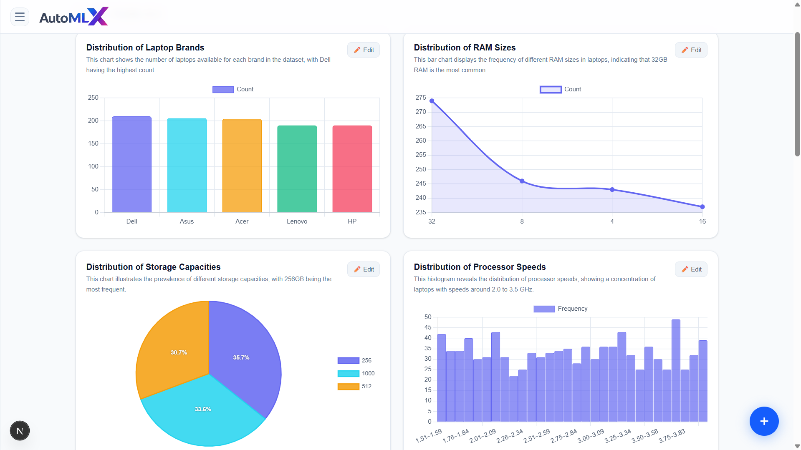

# AutoML

AutoML is a full-stack application for dataset ingestion, preprocessing, feature engineering, model training, evaluation, and analytics. The backend is a FastAPI service with an AutoML pipeline, and the frontend is a Next.js dashboard UI.

## Tech Stack
- Backend: Python 3.10, FastAPI, AutoGluon, scikit-learn, CatBoost, LightGBM, XGBoost
- Frontend: Next.js (App Router), React, Chart.js
- Storage: Supabase S3-compatible storage (with local fallback)
- Database: Postgres (Supabase)

## Project Structure
- backend/: FastAPI app, ML pipeline, analytics, storage utilities
- frontend/: Next.js UI
- storage/: Local fallback data storage under backend


## Prerequisites
- Python 3.10+
- Node.js 18+
- A Postgres database (Supabase recommended)
- Supabase storage credentials (or enable local fallback)

## Environment Variables
Create a backend .env file at backend/.env with the following keys:

```
POSTGRES_HOST=
POSTGRES_PORT=
POSTGRES_DB=
POSTGRES_USER=
POSTGRES_PASSWORD=

SUPABASE_URL=
SUPABASE_SERVICE_ROLE_KEY=
SUPABASE_BUCKET=storage
Access_key_ID=
Secret_access_key=
SUPABASE_LOCAL_FALLBACK=1

GEMINI_API_KEY=
GEMINI_MODEL=gemini-2.5-flash-lite
```

Notes:
- SUPABASE_LOCAL_FALLBACK=1 allows storing files under backend/storage when Supabase is unavailable.
- Supabase S3 uses Access_key_ID and Secret_access_key.

## Execution Steps

### 1) Start the backend
#### Repositories
- Backend: https://github.com/eswarsainandan04/automl-backend
```
cd backend
python -m venv .venv
.venv\Scripts\activate
pip install -r requirements.txt
uvicorn main:app --host 0.0.0.0 --port 8000
```

Backend health check:
- http://localhost:8000/

### 2) Start the frontend
```
cd frontend
npm install
npm run dev
```

Frontend:
- http://localhost:3000/

## Screenshots

### Upload


### Overview


### Feature Engineering


### Model Building


### Analytics


## Optional: Docker (backend only)
```
cd backend
docker build -t automl-backend .
docker run -p 8000:8000 --env-file .env automl-backend
```

## Notes
- The backend creates the users table on startup if it does not exist.
- Storage paths follow: input/{user_id}/{session_id}/, output/{user_id}/{session_id}/, meta_data/{user_id}/{session_id}/.
